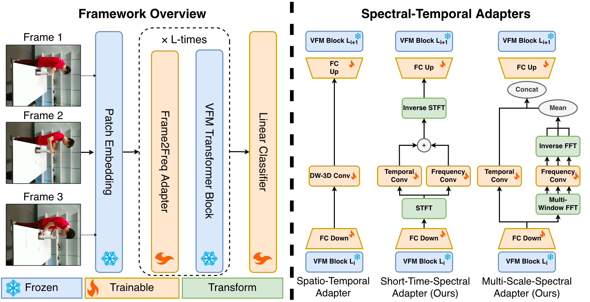

# [CVPR 2026] Frame2Freq: Spectral Adapters for Fine-Grained Video Understanding


This repo is the official implementation of [Frame2Freq: Spectral Adapters for Fine-Grained Video Understanding](https://openaccess.thecvf.com/content/CVPR2026/papers/Ponbagavathi_Frame2Freq_Spectral_Adapters_for_Fine-Grained_Video_Understanding_CVPR_2026_paper.pdf) at the IEEE/CVF Conference on Computer Vision and Pattern Recognition 2026, Denver, USA.

```
@InProceedings{Ponbagavathi_2026_CVPR,
    author    = {Ponbagavathi, Thinesh Thiyakesan and Seibold, Constantin and Roitberg, Alina},
    title     = {Frame2Freq: Spectral Adapters for Fine-Grained Video Understanding},
    booktitle = {Proceedings of the IEEE/CVF Conference on Computer Vision and Pattern Recognition (CVPR)},
    month     = {June},
    year      = {2026},
    pages     = {24073-24083}
}
```

## Overview



## Environment

Create a virtual environment with **Python 3.9** (or **3.10** / **3.11**), then install dependencies from [`requirements.txt`](requirements.txt). Python **3.9** is the minimum required by the pinned packages.

```bash
python3.9 -m venv frame2freq_env
source frame2freq_env/bin/activate
pip install --upgrade pip
pip install -r requirements.txt --extra-index-url https://download.pytorch.org/whl/cu118
```

The `--extra-index-url` flag is required because PyTorch is pinned to CUDA 11.8 wheels (`torch==2.7.1+cu118`, `torchvision==0.22.1+cu118`, `torchaudio==2.7.1+cu118`).

Verify the setup:

```bash
python -c "import torch; print(torch.__version__, torch.cuda.is_available())"
```

**Notes:**
- A CUDA **11.8**-compatible GPU and NVIDIA driver are required for training.
- If `decord` fails to install, ensure FFmpeg development libraries are available on your system and retry.

## Configuration

Some common configurations (e.g., dataset paths, pretrained backbone paths) are set in `config.py`.  Please modify the data paths and fill in the values before running the models.

## Dataset preparation

The data list should be organized as follows

```
<video_1> <label_1>
<video_2> <label_2>
...
<video_N> <label_N>
```

where `<video_i>` is the path to a video file, and `<label_i>` is an integer between $0$ and $M-1$ representing the class of the $i$-th video, where $M$ is the total number of classes.


After obtaining the videos and the data lists, set the root dir and the list paths in `config.py` in the `DATASETS` dictionary (fill in the blanks for `diving48` and `ssv2` or add new items for custom datasets). For each dataset, 5 fields are required:

* `TRAIN_ROOT`: the root directory which the video paths in the training list are relative to.

* `VAL_ROOT`: the root directory which the video paths in the validation list are relative to.

* `TRAIN_LIST`: the path to the training video list.

* `VAL_LIST`: the path to the validation video list.

* `NUM_CLASSES`: number of classes of the dataset.

## Backbone preparation

We use the CLIP checkpoints from the [official release](https://github.com/openai/CLIP/blob/a9b1bf5920416aaeaec965c25dd9e8f98c864f16/clip/clip.py#L30). Put the downloaded checkpoint paths in `config.py`. The currently supported architectures are CLIP-ViT-B/16 (set `CLIP_VIT_B16_PATH`) and CLIP-ViT-L/14 (set `CLIP_VIT_L14_PATH`). 

## Run the models

We provide some preset scripts in the [scripts/](scripts/) directory containing some recommended settings. For a detailed description of the command line arguments see the help message of `main.py`.

The preset scripts use `--blr 0.002` with `--batch_size 8` per GPU on **16 GPUs**, which gives an effective learning rate of **0.001** (`1e-3`). If you train with a different number of GPUs, scale `--blr` so the effective learning rate stays at 0.001:

```
effective_lr = blr × batch_size × num_gpus / 256
```

For `--batch_size 8` and a target effective LR of 0.001:

```
blr = 0.032 / num_gpus
```

Examples:

| GPUs | `--blr` | Effective LR |
|------|---------|--------------|
| 16   | 0.002   | 0.001        |
| 8    | 0.004   | 0.001        |
| 4    | 0.008   | 0.001        |

Alternatively, set the learning rate directly with `--lr 0.001` to skip automatic scaling.


## Acknowledgements

The CLIP model implementation is modified from [CLIP official repo](https://github.com/openai/CLIP) and [ST_Adapter](https://github.com/linziyi96/st-adapter). Thanks for their awesome works!
